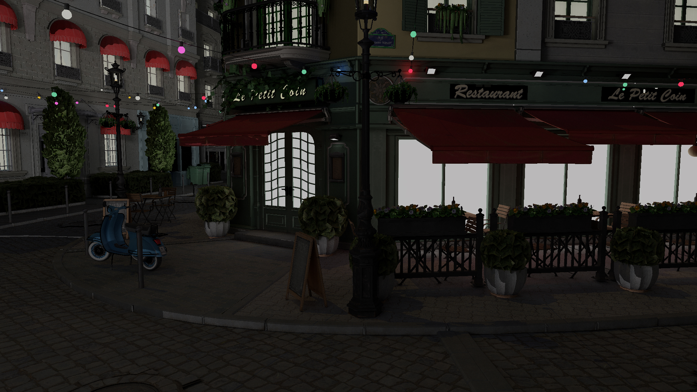

# Nocte Engine

A real-time DXR path tracer in D3D12 with RIS-based direct light sampling, a multi-pass
compute denoiser, and in-engine per-pass GPU timing.

**C++20 · DirectX 12 · DXR · HLSL · Windows 10/11 · Solo project**



*Amazon Lumberyard Bistro, accumulated to 4096 spp. **[Video demonstration →](https://youtu.be/k0EgTHNGC0c)***

> **Scope.** Direct lighting uses RIS — the initial-sampling stage of ReSTIR DI. Temporal
> and spatial reservoir reuse are **not** implemented. See [Known limitations](#known-limitations).

## What this demonstrates

- **Explicit D3D12 resource-state and descriptor management across a five-pass frame.** A
  single 34-slot CBV/SRV/UAV heap indexed by a compile-time enum, hand-managed UAV↔SRV
  transitions between the ray-tracing and compute passes, and an unbounded bindless texture
  array coexisting with fixed-slot descriptors via register spaces.
  → [`Renderer.h`](src/Renderer/Renderer.h) (heap slot enum), [`Renderer.cpp`](src/Renderer/Renderer.cpp) (`CreateShaderResourceHeap`)
- **A DXR pipeline assembled from raw state objects.** Ray-generation, miss, closest-hit and
  shadow-hit programs, two ray types, per-geometry local root signatures, and a shader binding
  table whose records carry per-instance vertex, index and material pointers.
  → [`Renderer.cpp:2161`](src/Renderer/Renderer.cpp#L2161) (`CreateHitSignature`), `CreateShaderBindingTable`
- **Monte Carlo integration implemented from the papers, not a framework.** Weighted reservoir
  sampling over a candidate light pool, GGX visible-normal importance sampling, a Disney
  diffuse/specular mixture with a consistent mixture PDF, and Russian-roulette path termination.
  → [`ReSTIR_IS.hlsl`](src/Shaders/ReSTIR_IS.hlsl), [`BSDF.hlsl`](src/Shaders/BSDF.hlsl)
- **GPU cost measured rather than estimated.** D3D12 timestamp queries bracket each pass, resolve
  to a readback heap, and drive a live per-pass overlay.
  → [`Renderer.cpp:1037`](src/Renderer/Renderer.cpp#L1037)
- **Debug tooling designed in.** A validation-frame mode flags out-of-range material and texture
  indices as magenta/yellow inside the closest-hit shader, so asset and binding errors show up in
  the image instead of silently sampling garbage.
  → [`Hit.hlsl`](src/Shaders/Hit.hlsl) (`IsDebugValidationFrame`)

## Technical breakdown

### Direct lighting — RIS over a candidate light pool

A compute pass reads the G-buffer written by the ray-generation shader and, per pixel, draws 32
candidate lights from the scene's analytic area lights plus the sun. Each candidate is accepted
into a reservoir with probability proportional to an unshadowed target function
`p̂ = N·L × luminance / d²`, using weighted reservoir sampling. The surviving sample carries the
unbiased contribution weight `W = W_sum / (M · p̂)`. No shadow rays are traced during selection —
visibility is tested once, in the closest-hit shader, against the single survivor.

*Trade-off.* This buys one good light sample per pixel for one shadow ray, which matters as light
count grows. Because there is no reuse pass, it is RIS (Talbot et al. 2005) rather than ReSTIR
(Bitterli et al. 2020). The reservoir is consumed one frame later and is **not reprojected**, so
under camera motion a pixel's reservoir can describe a surface that is no longer there.

→ [`ReSTIR_IS.hlsl`](src/Shaders/ReSTIR_IS.hlsl) · [`ReSTIR.hlsl`](src/Shaders/ReSTIR.hlsl) · consumed in [`Hit.hlsl`](src/Shaders/Hit.hlsl) · dispatched at [`Renderer.cpp:3114`](src/Renderer/Renderer.cpp#L3114)

### BSDF sampling and multiple importance sampling

Disney diffuse plus a GGX specular lobe, sampled as a mixture with lobe-selection probability
derived from `F0` and albedo. Directions come from Heitz's visible-normal distribution sampling;
both lobes are always evaluated for the chosen direction so `f·cosθ/pdf` stays energy-correct
regardless of which lobe was picked.

*On MIS, honestly.* The area lights are analytic quads in a constant buffer with no geometric
representation in the BVH, so a BSDF-sampled ray has zero probability of generating a sample on
one. The complementary strategy cannot fire, which makes the correct power-heuristic weight
exactly 1 — an earlier version applied `pdf_L²/(pdf_L² + pdf_B²)` here and simply discarded
energy. The MIS machinery for emitter hits is implemented and correct, but is currently inert
because no material is registered as an NEE light, so emissive Bistro geometry (bulbs, filaments)
is reached by BSDF sampling alone. Wiring that up is the next correctness task.

→ [`BSDF.hlsl`](src/Shaders/BSDF.hlsl) · [`MicrofacetBRDFUtils.hlsl`](src/Shaders/MicrofacetBRDFUtils.hlsl) · [`Hit.hlsl`](src/Shaders/Hit.hlsl)

### Denoising — À-Trous with albedo demodulation

An edge-avoiding À-Trous wavelet filter run as N ping-pong compute passes with a doubling step
size (default 5). Colour is demodulated by albedo before filtering and remodulated after, so the
filter operates on illumination and leaves texture detail intact. Edge-stopping weights use
normal, linear depth and luminance, with the luminance sigma widened by per-pixel variance
estimated from first and second moments.

*Trade-off.* Emissive pixels bypass the filter entirely (the normal buffer's `w` channel is the
mask), which keeps light sources crisp at the cost of leaving them noisier than their surroundings.

→ [`Denoise.hlsl`](src/Shaders/Denoise.hlsl)

### Temporal accumulation

Two mechanisms share the name. Progressive accumulation in the ray-generation shader averages
frames while the camera is static, and produces every converged image here. A separate
reprojection compute pass reconstructs world position from linear depth, reprojects through the
previous view-projection matrix, and blends history with per-pixel moments.

*Status.* The reprojection pass runs, but neighbourhood variance clamping is currently disabled
and the blend factor uses a global frame counter rather than a per-pixel history length, so it
ghosts under motion. Treated as unfinished rather than as a feature.

→ [`RayGen.hlsl`](src/Shaders/RayGen.hlsl) · [`TemporalAccumulation.hlsl`](src/Shaders/TemporalAccumulation.hlsl)

### Sky and glass

Preetham analytical sky (Perez luminance distribution, zenith chromaticity fits) with a
soft-edged solar disc, evaluated in the miss shader. Refractive materials are handled as a
specular BSDF with Fresnel-weighted Russian roulette between reflection and transmission, total
internal reflection on exit, and Beer–Lambert absorption over the true path length through the
medium.

→ [`SkyCommon.hlsl`](src/Shaders/SkyCommon.hlsl) · [`Miss.hlsl`](src/Shaders/Miss.hlsl) · [`Hit.hlsl`](src/Shaders/Hit.hlsl) (`HandleRefractiveHit`)

## Performance

Per-pass GPU timings come from D3D12 timestamp queries bracketing each pass, resolved to a
readback heap once per frame ([`Renderer.cpp:1037`](src/Renderer/Renderer.cpp#L1037)) and shown
live in the overlay. **They are not currently logged**, so the figures below are single-run
readings rather than averaged measurements — treat them as indicative.

| Pass | Time |
|---|---|
| Ray tracing | `<x.xx>` ms |
| Temporal | `<x.xx>` ms |
| Denoise (5 passes) | `<x.xx>` ms |
| Final / tone map | `<x.xx>` ms |
| **Total GPU** | **`<x.xx>` ms** |

`<GPU>` · driver `<version>` · 1920×1080 · Bistro exterior, 2 area lights + sun · 1 spp per frame ·
camera static at the position in the header image.

**To make these defensible:** append `m_PassTimesMs[0..3]` to a CSV each frame for 300 frames along
a fixed camera path, discard the first 60, and report mean and 95th percentile. The timing values
and a CSV-writing pattern already exist in `Renderer.cpp`; this is roughly 20 lines.

## Architecture

```
src/
├── Renderer/
│   ├── Renderer.cpp    # device, DXR pipeline, all passes (~5k lines — see Limitations)
│   ├── Renderer.h      # descriptor-heap slot enum, GPU-mirrored structs
│   └── FrameResource.h # PassConstants, per-instance data
├── Shaders/
│   ├── RayGen.hlsl     # camera rays, path loop, G-buffer, progressive accumulation
│   ├── Hit.hlsl        # closest hit: materials, NEE, reservoir shading, BSDF sampling
│   ├── Miss.hlsl       # Preetham sky + solar disc
│   ├── ReSTIR_IS.hlsl  # RIS candidate sampling (compute)
│   ├── Denoise.hlsl    # À-Trous + albedo demodulation (compute)
│   └── TemporalAccumulation.hlsl
├── Utils/              # geometry generation, OBJ loading, timing
└── RL/                 # separate path-guiding experiment (see Limitations)
```

One frame: **ray tracing** (DXR; writes radiance, normal, depth, world position) → **RIS initial
sampling** (compute; reservoirs for the next frame) → **history copy** → **temporal** (optional
compute) → **denoise** (N ping-pong compute passes) → **tone map and present**. Every pass indexes
a single descriptor heap whose slots are fixed by an enum in `Renderer.h`, and resource
transitions are issued explicitly at the call sites in `Draw()`.

## Build and run

**Requirements**

- Windows 10 2004 or later; GPU with DXR support (RTX 20-series or newer, RDNA2 or newer)
- Visual Studio 2022 or later with the "Desktop development with C++" workload
- CMake 3.24 or later (the build uses 3.24 features)
- Windows SDK 10.0.19041 or later — supplies `d3d12`, `dxgi`, `dxguid`, `d3dcompiler`, `dxcompiler`

**Get the scene mesh.** The Bistro mesh is *not* committed — it is roughly 300 MB and freely
available from its original source. Textures and material definitions **are** included.

1. Download **Amazon Lumberyard Bistro** from
   [NVIDIA ORCA](https://developer.nvidia.com/orca/amazon-lumberyard-bistro) or
   [Morgan McGuire's Computer Graphics Archive](https://casual-effects.com/data/).
2. Place the exterior mesh at `src/Models/exterior.obj`.

The build copies it next to the executable automatically. Without it the engine fails on startup
while loading `Models/exterior.obj`.

**Build**

```bash
git clone https://github.com/ZeshanRasul/NocteEngine
cd NocteEngine
cmake -B out/build/x64-Release
cmake --build out/build/x64-Release --config RelWithDebInfo
```

Run this from a Developer Command Prompt, or run `vcvars64.bat` first, so CMake finds the
toolchain. Opening the folder directly in Visual Studio also works — `CMakeSettings.json` defines
`x64-Debug` and `x64-Release` configurations.

**Run.** Shaders and assets are copied next to the executable and loaded relative to the working
directory, so launch it from its own output folder:

```bash
cd out/build/x64-Release/bin/RelWithDebInfo
./NocteEngine.exe
```

F5 from Visual Studio also works; the debugger working directory is set to the output folder.

**Controls.** `W`/`A`/`S`/`D` to move, mouse drag to look, `H` toggles the UI. Denoiser pass count
and sigmas, area-light parameters, sun direction and colour, exposure, tone mapping and samples
per pixel are all exposed in the ImGui panels.

**A successful run** opens a window on the Bistro exterior under a Preetham sky, visibly
converging over the first few seconds while the camera is still, with the per-pass GPU timing
overlay in the corner.

## Known limitations

- **RIS, not full ReSTIR.** No temporal or spatial reservoir reuse. The reservoir is one frame
  stale and unreprojected, so it degrades under camera motion.
- **MIS is currently inert.** The emitter-hit MIS weighting is implemented but unreachable,
  because no material is registered as an NEE light; emissive geometry is sampled by BSDF alone
  and is noisier than it needs to be.
- **Temporal reprojection ghosts under motion** — variance clamping is disabled and the blend
  factor uses a global frame counter rather than a per-pixel history length.
- **No runtime toggle for RIS**, so on/off comparisons require a code change to reproduce.
- **`Renderer.cpp` is ~5,000 lines across 95 methods.** It grew from a rasterizer and each new pass
  was added in place. The descriptor-slot enum and the extracted `Do*Pass()` functions are the
  seams along which it should be split; that refactor is not done.
- **Only the Bistro exterior loads.** Sponza and Cornell Box assets were removed as no matching
  mesh shipped with them; scene selection currently affects constant-buffer sizing only.
- **`src/RL/` is a separate experiment** in reinforcement-learning path guidance, partially wired
  up and not part of the rendering path described above.

**Next:** temporal reservoir reuse with reprojection, then spatial reuse; register emissive
geometry as NEE lights so MIS becomes live; add a frame-time logging harness; split
`Renderer.cpp`.

## References

Techniques implemented here, with the sources used:

- Bitterli, B., Wyman, C., Pharr, M., Shirley, P., Lefohn, A., Jarosz, W. (2020). *Spatiotemporal
  reservoir resampling for real-time ray tracing with dynamic direct lighting.* ACM TOG 39(4).
  — reservoir formulation, target function, unbiased contribution weight.
- Talbot, J., Cline, D., Egbert, P. (2005). *Importance Resampling for Global Illumination.*
  Eurographics Symposium on Rendering. — the RIS estimator as implemented here.
- Chao, M. T. (1982). *A general purpose unequal probability sampling plan.* Biometrika 69(3).
  — weighted reservoir sampling.
- Veach, E., Guibas, L. (1995). *Optimally Combining Sampling Techniques for Monte Carlo
  Rendering.* SIGGRAPH '95. — multiple importance sampling and the power heuristic.
- Heitz, E. (2018). *Sampling the GGX Distribution of Visible Normals.* JCGT 7(4). — VNDF sampling.
- Burley, B. (2012). *Physically Based Shading at Disney.* SIGGRAPH Course Notes. — diffuse model
  and metal workflow.
- Dammertz, H., Sewtz, D., Hanika, J., Lensch, H. (2010). *Edge-Avoiding À-Trous Wavelet Transform
  for Fast Global Illumination Filtering.* HPG 2010. — the denoiser.
- Schied, C. et al. (2017). *Spatiotemporal Variance-Guided Filtering.* HPG 2017. — albedo
  demodulation and variance-driven edge stopping.
- Preetham, A. J., Shirley, P., Smits, B. (1999). *A Practical Analytic Model for Daylight.*
  SIGGRAPH '99. — sky model.
- Haines, E., Akenine-Möller, T. (eds.) (2021). *Ray Tracing Gems II* — "Demystifying the Shader
  Binding Table" and "MIS 101".
- Luna, F. *Introduction to 3D Game Programming with DirectX 12.* — geometry generator and D3D12
  foundations.

**Third-party code and assets.** See [THIRD-PARTY-NOTICES.md](THIRD-PARTY-NOTICES.md). In short:
`nv_helpers_dx12` (NVIDIA) provides the acceleration-structure builders, ray-tracing pipeline
generator, root-signature generator and shader-binding-table generator, and `manipulator.cpp`
(NVIDIA) the camera manipulation. Model loading is tinyobjloader, image I/O is stb, UI is Dear
ImGui, maths is GLM and DirectXMath. Everything under `src/Shaders/` and `src/Renderer/` is mine.

**Licence.** [MIT](LICENSE) for the code; scene assets carry their own Creative Commons terms.
