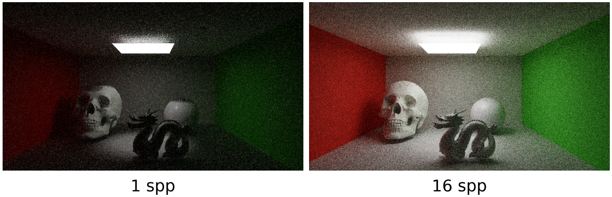
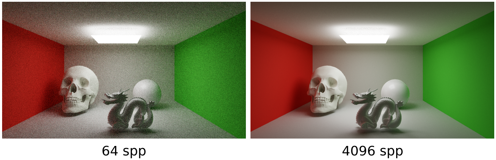
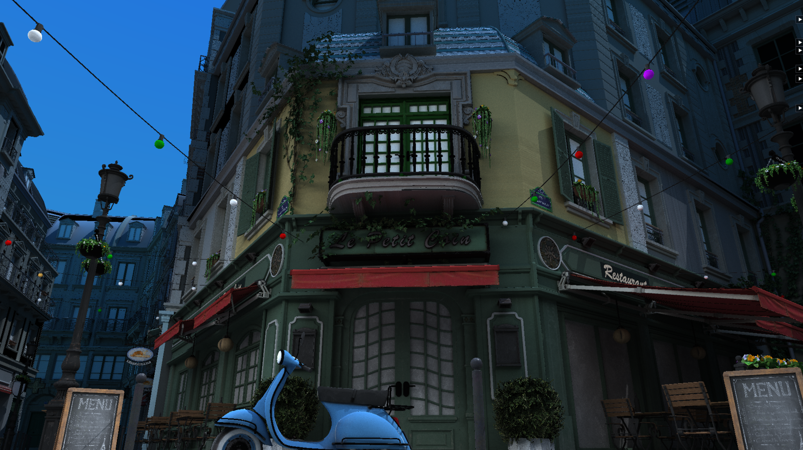
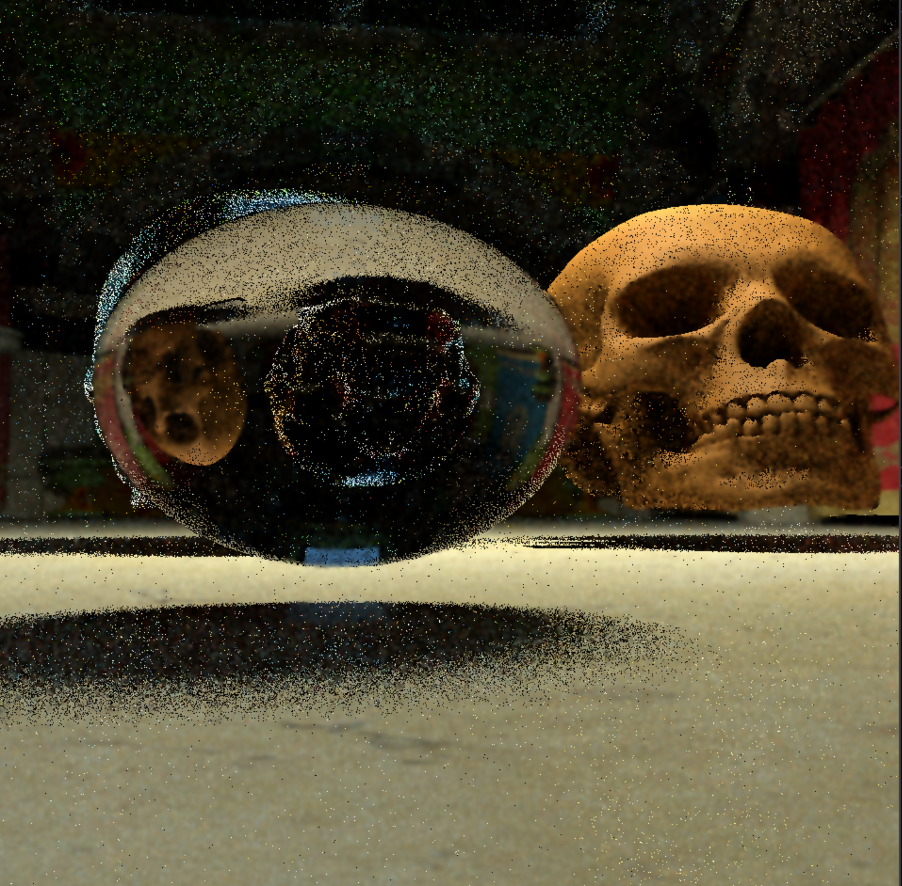
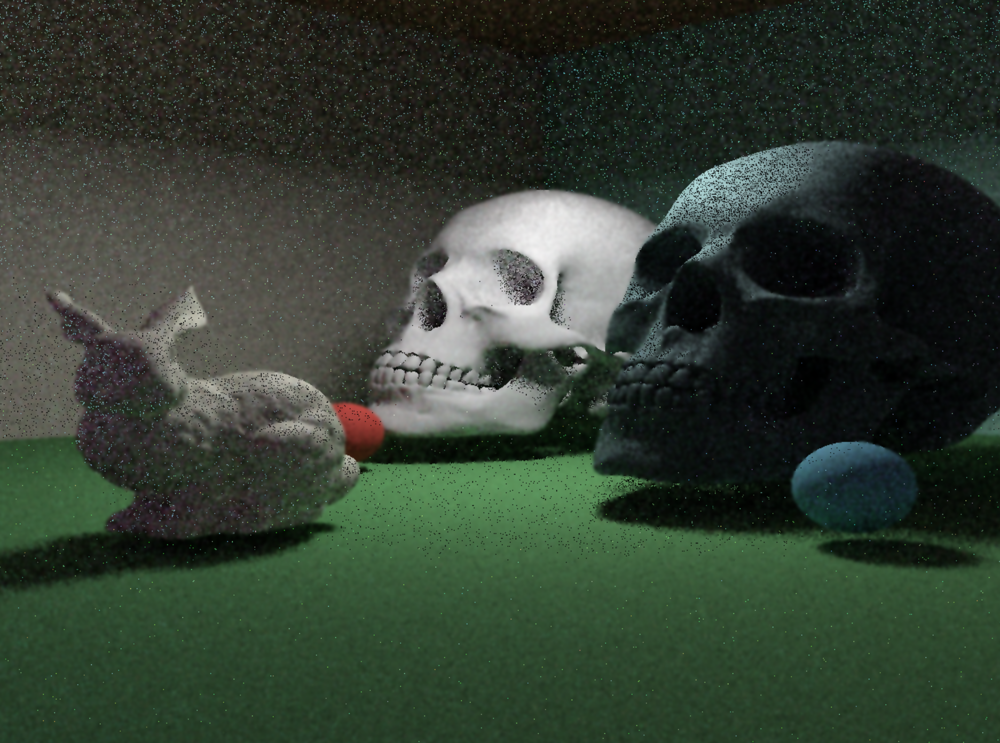
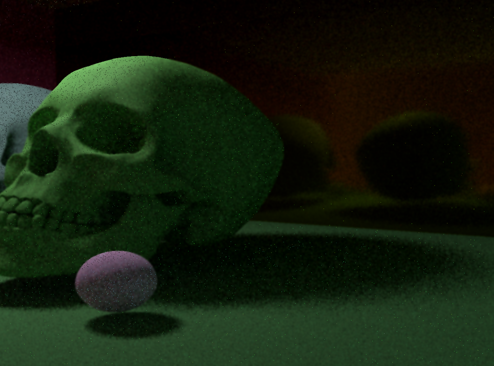

# Nocte Engine - DXR Path Tracer


Nocte Engine is a real-time path tracing rendering engine built using DirectX Raytracing (DXR). The project was born out of my passion for pushing the boundaries of real-time physically accurate rendering techniques and to build a strong understanding of the real-world considerations involved in creating beautiful and realistic worlds in 3D interactive media. 

While I have previous experience with rasterization-based engines made in DirectX 12 and OpenGL, my love of low-level programming along with a deep fascination of the science and mathematics behind ray tracing algorithms fueled my desire to create a real-time path tracer. The video demonstration of the engine can be found here: [https://youtu.be/AWzmRLeegWA](https://youtu.be/rE1wNrLTct0)

## Visual Results

Most recent results following implementation of MIS, NEE, denoising and temporal accumulation:

[](./docs/images/comparison_row1_.png)

[](./docs/images/comparison_row2.png)

Figure 1: Comparison of Cornell Box scene at 1, 16, 64 and 4096 samples per pixel

<br>
<br>

[](./docs/images/comparison_row2.png)

Figure 2: Work in progress results of the Bistro scene with a focus on improving the denoising and temporal accumulation to achieve better convergence and image quality at low SPP.
<br>
<br>
## Early Results
The images below showcase various visual results achieved with Nocte Engine throughout development. Each scene highlights different aspects of the engine's capabilities.

[](./docs/images/SponzaDemoWithUI.png)
Figure 3: Real-time DXR path tracing with multiple importance sampling, next event estimation and spatial denoising enabled, showcasing a refractive sphere, refractive skull and matte skull in the Crytek Sponza scene.

<br>
<br>

[](./docs/images/CornellBoxStanfordBunny.png)
Figure 4: Cornell Box scene with Stanford Bunny model demonstrating global illumination with diffuse interreflections, soft shadows and area light sampling.

<br>
<br>

[](./docs/images/CornellBoxReflections.png)

Figure 5: Cornell-style scene demonstrating multi-bounce reflection paths of a rough reflective back wall. This scene highlights the recursive ray traversal, BSDF sampling for specular lobes and a physically accurate example of reflected paths with indirect illumination.

<br>
<br>

[](https://youtu.be/AWzmRLeegWA)

Figure 4: Clickable image link to YouTube demo video showcasing a flythrough of the Crytek Sponza scene rendered with Nocte Engine, highlighting global illumination, refractions, and soft shadows.

## Overview

Fundamentally, Nocte Engine was created not just as a learning experience in low-level graphics programming, but also as a project to demonstrate and showcase my understanding of cutting-edge rendering techniques and ability to build performant and complex architectural systems.

Nocte Engine gave me the opportunity to implement and experiment with advanced techniques, first starting with the core Whitted style ray tracing techniques of shadows, reflections and refractions and then build upon these foundations with Multiple Importance Sampling, Next Event Estimation and BSDF evaluation. These techniques allowed me to take a rasterization based D3D12 engine, create a basic real-time raytracer and then extend this groundwork into a high-fidelity real-time path tracer.

Over the course of two months, from the first D3D12 pipeline creation to the current stage of improving the denoising and visual clarity of the path tracer, I have been able to create a renderer which is highly relevant to the modern day engines in the AAA games industry.

## Project Goals

As discussed, Nocte was created with a number of key goals, which organically and naturally developed over time. As I have found, the more you find yourself achieving, the greater your ambitions become and nothing fuels passion more than taking incremental steps that breakdown a project from achievable (STAR-like) milestones to a advanced system of many parts.

The core goals I set out to achieve on this journey were:

- Build a real-time path tracer using DirectX Raytracing
- Explore state-of-the-art rendering techniques such as Multiple Importance Sample and Next Event Estimation
- Reinforce and deepen my understanding of low-level programming in C++, DirectX 12, and HLSL
- Build project-based experience in understand and leveraging the CPU and GPU to their full potential 
- Create a visually impressive piece that showcases not just my technical abilities but also my understanding of art and design principles in 3D rendering

## Key Technical Features 

My Nocte Engine development journey involved the implementation of a number of advanced features as well the establishment of robust architectural systems. These features include:

- Robust DXR Ray Tracing Pipeline using Acceleration Structures, ray tracing shaders, well defined shader binding tables and complex multi-pass rendering for path tracing, temporal accumulation and denoising
- Path tracing with Multiple Importance Sampling and Next Event Estimation for realistic lighting and global illumination building upon foundational Whitted style ray tracing
- Robust denoising in a compute pass with the A-Trous ping pong algorithm that is customizable during runtime with an in engine GUI
- Support for .obj model loading, multiple texture binding, and material use
- Performance measurement including FPS counter, average frame time, and extensive GPU profiling with Nvidia Nsight Graphics
- Internal geometry creation tools for sphere, cubes, and other primitives
- Refitting of acceleration structures for dynamic scene updates
- Post processing effects using the ACES technique

## Rendering Architecture

The rendering in Nocte is executed through a number of steps:

- TLAS update where instance transforms are updated (used in early development in the Whitted style scene)
- Ray dispatch stage executing the Raygen and any further DXR shaders
- Temporal Accumulation with a dedicated pipeline using the compute shader (currently WIP)
- Denoising A-Trous compute shader pass executed N number of times per frame where N is exposed to the engine GUI.
- Tone mapping (currently in final denoise pass but will be moved to it's own final pass)
- UI rendering pass using ImGui

The engine leverages a number of buffers and resources each with a clear and defined role through the multi-pass rendering pipeline.
The raytracing pass writes to an Accumulation Buffer and reads from an Accumulation History Buffer which is leveraged for the work in progress temporal accumulation work.
This allows the final Accumulation Buffer to contain a blended value between the previous frame and current frame. The Accumulation Buffer is then copied into the Accumulation History Buffer in order to be used in the next frame.

The temporal accumulation pass then reads from the Accumulation Buffer and writes to a Temporal Accumulation Radiance buffer while using mean and mean squared moment vectors.
Finally the TA radiance is used as the input of the first of N denoising passes, with subsequent passes using a ping pong pair of buffers which alternate as input and output.

## Ray Tracing Pipeline

The DXR ray tracing pipeline in Nocte Engine is built around a well defined set of shaders and a shader binding table (SBT) that maps the shaders to the geometry in the scene. Although the SBT felt complex at first, I was able to break down the process into manageable steps and create a robust system that could be extended as needed.

The pipeline consists of the following shaders:
- Ray Generation Shader: This is the entry point for ray tracing. It generates rays for each pixel on the screen and initiates the path tracing process.
- Miss Shader: This shader is invoked when a ray does not intersect any geometry in the scene. It currently returns a background gradient and will be extended to sample environment map for more realistic lighting effects.
- Closest Hit shader: This shader is one of the most interesting parts of the pipeline. When a ray intersects with geometry in the acceleration structure this shader is executed and populates the ray payload with a breadth of information after sampling area lights, checking whether a pixel is occluded (and thus in shadow) and whether a reflection or refraction ray should be dispatched.

A number of helpers are also used for path tracing to evaluate the BSDF, sample lights and perform MIS calculations.

In terms of acceleration structures, the engine builds a bottom level acceleration structure (BLAS) for each mesh in the scene and top level acceleration structure (TLAS) that contains the entire scene. The TLAS creation is set up in such a way that it is possible to refit the TLAS at runtime if necessary. There is an example of this in practice in the visual demonstration section, and TLAS refitting was used in the Whitted style phase of development.
 
## Lighting and Global Illumination

Nocte Engine implements physically based lighting models in order to achieve realistic lighting and global illumination effects. The techniques used allow ray and path tracers to achieve high-fidelity that rasterization algorithms would struggle or be unable to achieve, highlighting the importance of ray tracing to the future of 3D game, film and visualisation technologies.
The shaders utilise both direct and indirect illumination algorithms resulting in beautifully rendered scenes with diffuse interreflections, soft shadows, reflections and refractions.

Direct lighting is implemented using Next Event Estimation (NEE) where the area light sources in the scene are sampled directly from the ray-surface intersection point and shadow rays are traced in order to evaluate whether an intersection point is occluded by geometry and thus in shadow.

Global illumination is achieved through path tracing with Multiple Importance Sampling (MIS). This technique allows the engine to sample both the BSDF and light sources in order to reduce variance and noise in the final render. By combining these two sampling strategies, the engine can produce high-quality images with fewer samples per pixel, making real-time path tracing feasible. As mentioned in the references section, the MIS 101 chapter of Ray Tracing Gems II was an extremely valuable resource to understanding the difference and impact of using MIS compared to solely using BSDF sampling or light sampling alone.

## Materials and Shading

Material evaluation in Nocte Engine is based on the now industry standard Physically Based Rendering (PBR) techniques. The engine supports a range of material properties including albedo, roughness, metallic and will be (easily) extended to include emissive properties. These properties are used in the BSDF evaluation to calculate how light interacts with surfaces in the scene.

The BSDF implementation uses Lambertian reflectance for diffuse surfaces along with the Disney GGX microfacet model for specular reflections, leveraging the Schlick Fresnel approximation. Probability density functions (PDFs) are calculated for both the BSDF and light sampling strategies resulting in improved Multiple Importance Sampling.

## Denoising and Temporal Accumulation

As with all path tracers, Nocte experiences the same inherent noise at low SPP (samples per pixel) due to the lack of convergence of the algorithm. To counter this noise, Nocte has spatial denoising and work in progress temporal accumulation, used to improve the image quality and convergence.

The temporal accumulation approach is to accumulate and blend between radiance values from multiple frames when the scene is stationary. The present approach resets this accumulation on camera movement in order to ensure stale radiance values from previous camera perspectives do not blend with new perspectives.

The spatial denoising has been implemented using A-Trous wavelet filter on the compute shader using normal and depth data to preserve edges while reducing noise. It is widely configurable with a multi-pass ping pong system and parameters that are exposed through the GUI. This ensures users and developers can quickly iterate and experiment with a range of parameter combinations and thus reach an optimal denoising state for their needs.

## Scene Management

The scenes in Nocte consist of mesh instances, their transforms and materials as well as acceleration structure references. Meshes can either be loaded using the engines OBJ loader, leveraging the lightweight tinyobj header only library or through the engines geometry generator which leverages a system from the leading text Frank Luna's Introduction to Game Programming with DirectX 12.

All instance materials are stored in a structured buffer which is accessed using a per instance material index bound to the shaders as a constant buffer. This ensures constant buffer sizers do not grow excessively as instance counts increase.

The acceleration structure architecture allows for runtime updates to the TLAS known as refitting as can be demonstrated from an early development video of rotating skulls. 

Furthermore, core renderer settings such as camera controls, area light parameters and the previously discussed denoising parameters are exposed to the developer through a GUI. This ensures Nocte is practical and easily modifiable by the users and demonstrates the steps taken to mirror industry standard engine workflows in debugging, feature development and the many tweaks required in a graphics engine to achieve the best possible renders.

## Performance and Profiling

When building an engine as computationally expensive as a real-time path tracer, it is essential to monitor performance, design architecture in a way that results optimal efficiency and tie profiling systems and considerations within the projects core. As such, performance metrics have been monitored on both the CPU and GPU side.

Nocte records frame times, average frame times and frames per second counters to under which scenarios and setups have a meaningful impact on performance, both positive and negative. By exposing performance impacting parameters such as the number of denoising passes executed, the developer is able monitor and find balance in performance and quality of the final real-time rendered scene. Furthermore, by accessing these parameters through the GUI, quick iteration loops and subtle tuning and experimentation become easy for the developers and users.

NVIDIA Nsight Graphics has been used extensively to inspect render times, GPU processing performance, shader execution times, and memory access patterns. This identification and understanding of GPU bottlenecks is invaluable in confirming and validating (or refuting) developer assumptions about performance trade-offs and is an essential skill for any computationally demanding scenario particularly GPU related programming.

## Tools, Debugging and Validation

Creating systems that are easy to debug and validate is just as important as building the engine core features and as such a strong emphasis was placed on debugging, whether it is through debug visualisations or tracking and exposing key parameters to the GUI. A core part of debugging included using Visual Studio's built in debugger to measure and review variables within the code, order of execution and follow the call stack in order to reason and rationalise any bugs that will inevitably arise in any computer program. 

Furthermore, the D3D12 debug controller was enabled in all debug builds to ensure that any misuse of the DirectX API was quickly identified and solved. Such API debug tools are invaluable in any graphics project and as such it was treated as a core priority to become familiar with the several types of common (and not so common) warnings and errors and handle and solve them diligently.

As mentioned earlier, Nsight Graphics was also essential in debugging GPU side computations and was deeply beneficial to monitor and confirm successful binding of buffers and resources to shaders, ensure acceleration structures were correctly built, modified and integrated into the engine and to confirm that root parameters were valid throughout the pipeline.

Finally, the rendering of scenes was developed in such a way as to incrementally increase in complexity. Starting with a simply Whitted style raytracer setup with spheres, boxes, planes and in this case, the skull mesh from Luna's text it was simple to implement, test and debug the core raytracing features, from determining visibility to tracing reflection and refraction rays. MIS and NEE were implemented using simple Cornell box style scene which allowed for feature testing with a small number of meshes within an enclosed space with a single area light. Once these more straightforward scenes were found to be working correctly, more complex models were integrated such as the Chinese Dragon mesh and Crytek Sponza environment, both sourced from Morgan McGuire's 3D model repository (referenced below).

## Technical Challenges and Solutions

Technical challenges are present in all complex graphics projects and working on Nocte was not an exception to this rule. The majority of challenges arose from the complexity of low-level APIs such as DirectX 12 and DXR and were important learning experiences that have bolstered my toolkit of software skills and allowed me to be well prepared when working with these APIs in future, to both plan in advance for some challenges and to know how to deal with other challenges when they inevitably arise.

An early difficulty was structuring the Shader Binding Table in a way that is easy to extend and modify and the interaction of descriptor heaps with the SBT. I do not feel alone in this challenge given Ray Tracing Gems II has a whole chapter dedicated to "Demystifying the Shader Binding Table". This resource and others online, including the incredibly useful Microsoft DXR documentation proved invaluable in allowing me to fully understand the SBT and structure it in such a way that reduced duplication of code. These references and a calm and determined demeanour helped me break the challenge down into smaller pieces and gradually create a more extensible system with an incremental approach.

A challenge which ties into future work is that of denoising and temporal accumulation. While the A-Trous denoiser is implemented and functioning well, with a noticeable difference when it is enabled, the temporal accumulation still needs some further development time to be functioning and noticeable. Central to this challenge is the complex and sometimes initially fragile approach of transitioning multiple resources across a complex pipeline and ensuring that they are always in the correct state defined by their location in the rendering pipeline. Again this has been a strong learning experience, and I have developed a deeper understanding of resource states, the state relevance to different uses within a pipeline and how best to structure a pipeline and choose the right resources for various scenarios.

## Build and Run Instructions

Nocte Engine is CMake-based project and targets modern Windows systems with DirectX 12 and DirectX Raytracing support.

### Prerequisites
- Windows 10 or later
- Visual Studio 2022 or later with C++ development workload
- CMake 3.15 or later
- DirectX 12 SDK
- NVIDIA GPU with DXR support (e.g., RTX series)
- Git for cloning the repository

### Building the Project

Clone and build the project as follows:
   ```bash
	git clone https://github.com/ZeshanRasul/NocteEngine
	cd NocteEngine
	mkdir build
	cd build
	cmake ..
   ```

This will generate the Visual Studio solution files in the build directory after which you can use Visual Studio to build the executable in either Debug or Release mode.
   
### Running the Engine

To run the engine, simply execute the generated NocteEngine.exe file from the build directory. Ensure that the working directory is set correctly so that the engine can locate shader and asset files correctly. The engine launches into the Sponza scene shown in the video demo with an interactive camera which can be controlled with the WASD keys.

## Future Work

Nocte Engine is a continually evolving project, and below a number of future developments and enhancements are listed:
	
- Improved temporal accumulation
	- Finalising and refining the temporal accumulation pass to effectively denoise and converge over time.
	- Use of motion vectors and reprojection in order to improve accumulation during camera and scene movement.
- Advanced denoising techniques
	- Experimenting with machine learning based denoising methods for improved render quality at low spp.
	- Utilising hybrid denoising approaches combining spatial and temporal methods.
	- Exploring the use of third-party denoising libraries such as NVIDIA OptiX or Intel Open Image Denoise.
- Environment mapping
	- Implementing HDR environment maps for realistic lighting and reflections.
	- Importance sampling of environment maps to improve lighting quality.
- Material  system enhancements
	- Adding support for emissive materials to allow for self-illuminating objects.
	- Implementing subsurface scattering for more realistic skin and organic materials.
- Engine and Tooling Enhancements:
	- Developing an industry standard scene editor for easier scene creation and modification.
	- Supporting additional model formats and material types beyond .obj models.
 
These enhancements outline exciting directions for Nocte Engine to continue to develop and evolve, ensuring it utilises cutting-edge techniques and truly demonstrates the beauty and elegance of ray and path tracing to users and end players.

## Acknowledgments, References, and Resources

While all development on Nocte has been carried out solely by myself, as with any modern day graphics project, we as developers stand on the shoulders of giants. Giants for whom I am extremely grateful. Below are a number of references and resources I utilised during my development. As I continue to work on Nocte, it's likely this list will grow and I will ensure to keep it updated so that those with a similar passion for learning can easily find useful resources.

### Books
 - Ray Tracing Gems II - Eric Haines and Tomas Akenine-Moller (Editors)
 - Introduction to Game Programming with DirectX 12 - Frank Luna
 - Physically Based Rendering: From Theory to Implementation - Matt Pharr, Wenzel Jakob, and Greg Humphreys
 - Real-Time Rendering, Fourth Edition - Tomas Akenine-Moller, Eric Haines, Naty Hoffman
	
### Documentation and Online Resources
 - Microsoft DirectX 12 Documentation: https://learn.microsoft.com/en-us/windows/win32/direct3d12/directx-12-graphics
 - Microsoft DirectX Raytracing (DXR) Documentation: https://learn.microsoft.com/en-us/windows/win32/direct3d12/directx-raytracing
 - NVIDIA Developer Blog - Real-Time Ray Tracing: https://developer.nvidia.com/rtx/raytracing
 - Morgan McGuire's 3D Model Repository: https://casual-effects.com/g3d/data10/index.html

### Tools and Libraries
 - DirectX 12 and DXR
 - NVIDIA Nsight Graphics
 - TinyOBJLoader
 - ImGui
