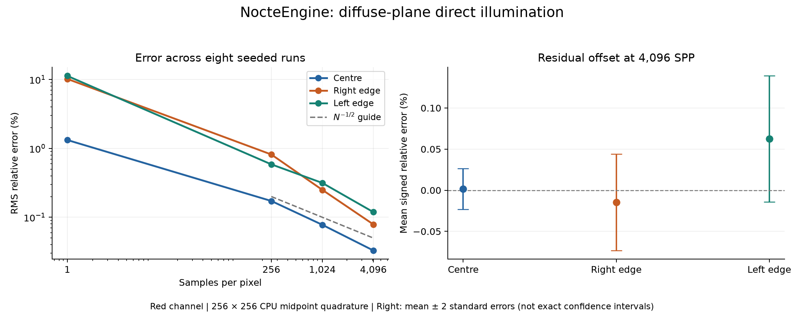

# Diffuse-plane quadrature validation

Batch: `2026-09-16_12-34-53Diffuse_Plane`. Eight separately seeded runs; seeds [1, 2, 3, 4, 5, 6, 7, 8].



All table values below are percentages, using the red channel at 4,096 SPP. CSV includes every RGB channel and checkpoint.

| Probe | Mean signed error | Sample SD | Standard error of mean | RMS error |
|---|---:|---:|---:|---:|
| Centre | +0.00164 | 0.03521 | 0.01245 | 0.03297 |
| Right edge | -0.01463 | 0.08287 | 0.02930 | 0.07889 |
| Left edge | +0.06243 | 0.10830 | 0.03829 | 0.11900 |

## What this supports

For this fixed, unobstructed diffuse-plane fixture, three rendered probes approach a separately evaluated double-precision rectangle integral as sample count increases. RMS error decreases at every recorded checkpoint for all three red-channel probes. At 4,096 SPP, each mean signed red-channel error is within two estimated standard errors of zero; eight runs do not establish absence of small bias.

The left panel uses sqrt(mean((render/reference - 1)^2)) across runs. The right panel uses the sample standard deviation divided by sqrt(8). Error bars are descriptive ±2 SEM, not exact 95% confidence intervals. Checkpoints within each run share samples. Channels share samples and are not independent trials.

## Scope and remaining gates

- Reference: 256-by-256 midpoint quadrature at each recorded world point, not an exact closed-form solution. Refinement was checked in the supplied captures.
- Pointwise comparison assumes fixed pixel-centre primary rays, zero aperture, matching world intersections, and no occluder. Full-image pixel-filter agreement is a separate test.
- Captures and source inspection support the corrected upload/reset/capture sequence for one sample per frame. GPU constants were not independently read back by this plotting script.
- Verify multiple samples per frame and sample-key invariance across frame grouping before closing that gate.
- Confirm bounded CLI replay, complete configuration/provenance, build/shader/scene hashes, hardware/driver records and validation-output retention.
- Complete GPU pass timing/PIX annotations and separate CPU update, recording, wait and present measurements. These synchronous readback runs are correctness evidence, not representative performance measurements.
- Add an independent Mitsuba RGB scene comparison with matching geometry, light units, reflectance, camera and pixel-filter conventions. Track point versus pixel-average differences explicitly.
- This does not validate general materials, visibility/shadows, indirect transport, volumes, temporal reconstruction, arbitrary scenes or performance.

The source manifest hashes the input JSON files only; it does not substitute for missing renderer build/shader/scene provenance.

## Reproduction

Paths in sources.json are relative to its containing directory. From this report directory, run:

```powershell
python compare_quadrature_runs.py "runs/*/quadrature_integral.json" --csv statistics.csv
python plot_quadrature_validation.py --root runs --batch 2026-09-16_12-34-53Diffuse_Plane --out .
```

Plotting requires Matplotlib; the comparison script uses only the Python standard library. Preserve the source JSONs with this report. CSV is globally ignored by the repository, so explicitly choose how validation artifacts are retained.
